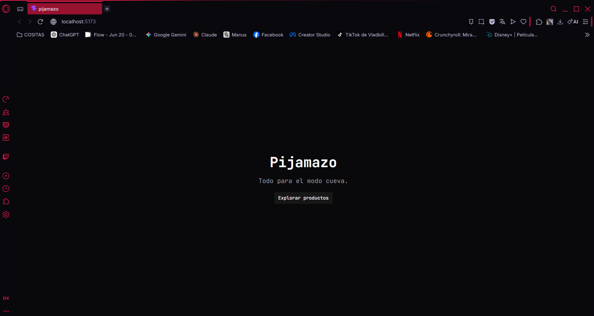
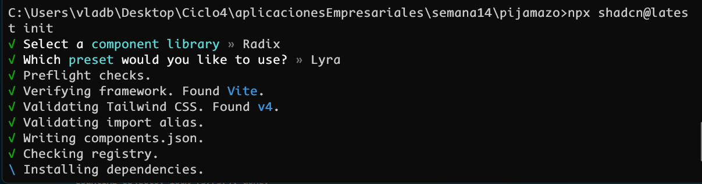
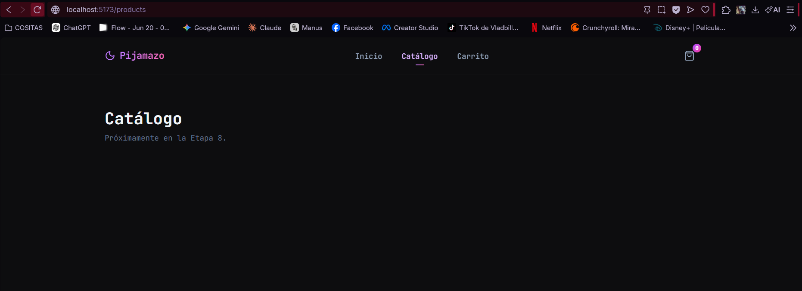
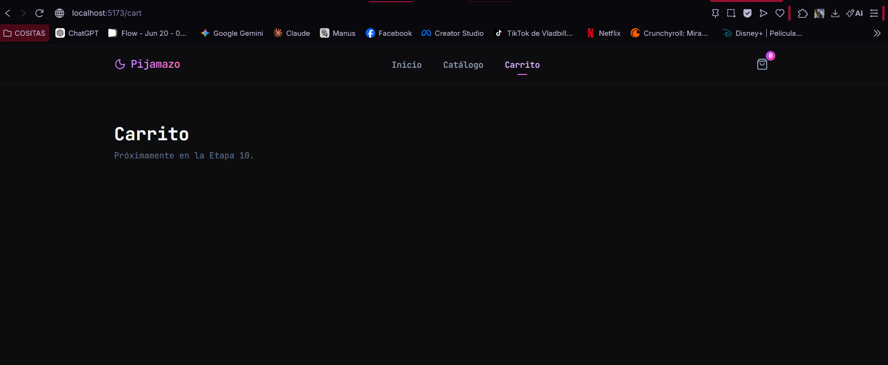
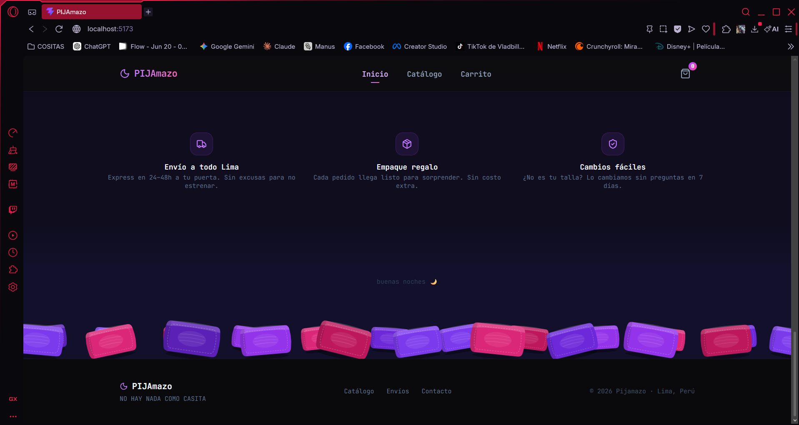
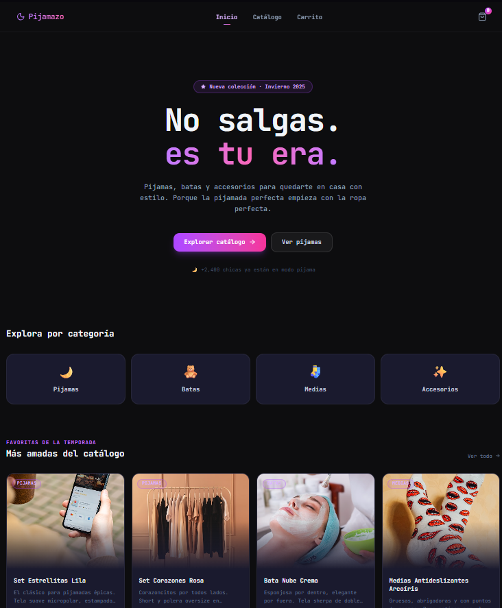

# 🌙 Pijamazo

E-commerce de pijamas y ropa cómoda para adolescentes. "IRL? no lo recomiendo."

🔗 **Deploy:** [pijamazo.vercel.app](https://pijamazo.vercel.app)

## Integrantes:
  ### William Julon 
  ### Gabriel llanos
  ### Alexander Sanabria
---


## Estructura

```
src/
├── components/       # Componentes reutilizables (StarField, PillowField, ui/)
├── data/             # Productos mock
├── hooks/            # Custom hooks
├── layouts/          # RootLayout con navbar y footer
├── pages/            # HomePage, ProductsPage, CartPage
├── routes/           # Router con React Router DOM
├── services/         # Capa de servicios (Axios)
└── types/            # Tipos TypeScript (Product, Category)
```

---

# Evidencias

### 1. Creación de proyecto e instalación de shadcn





### 2. Creación de rutas





### 3. Creación de layout



<!-- Agrega docs/3w.png con captura de: RootLayout con navbar, footer y las rutas navegando -->

### 4. Homepage



## Carrera

Diseño y Desarrollo de Software — IV Ciclo · Tecsup 2026